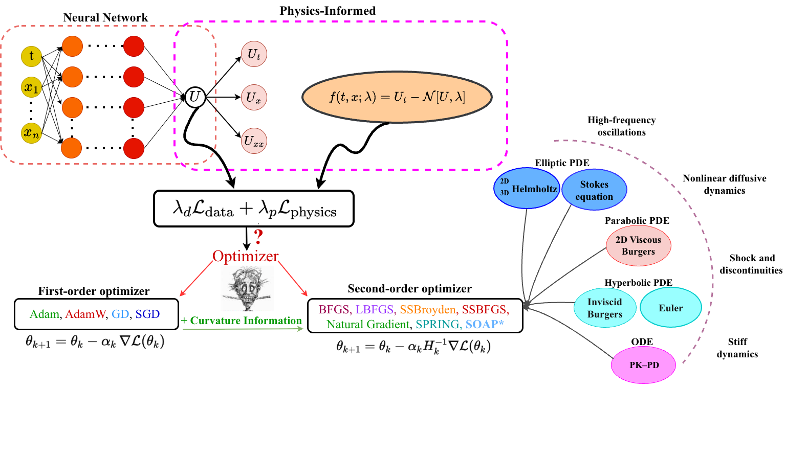

This repository includes the implementation of  
**Curvature-Aware Optimization for High-Precision Physics-Informed Neural Networks**.




<h1 align="center">SS-Quasi-Newton-Optimistix</h1>

This library provides two quasi-Newton optimizers — **SSBFGS** and **SSBroyden** — developed on top of [Optimistix](https://github.com/patrick-kidger/optimistix), a [JAX](https://github.com/google/jax)-based library for nonlinear solvers including root finding, minimization, fixed-point problems, and least-squares optimization.

---

# Installation

## Install JAX (CUDA 12)

```bash
pip install -U --pre jax jaxlib "jax-cuda12-plugin[with-cuda]" jax-cuda12-pjrt \
  -i https://us-python.pkg.dev/ml-oss-artifacts-published/jax/simple/
```

## Install SS-Quasi-Newton-Optimistix

```bash
pip install git+https://github.com/raj-brown/optimistix.git@SSBFGS
```

## Requirements

- Python 3.10+
- JAX 0.4.38+
- [Equinox](https://github.com/patrick-kidger/equinox) 0.11.11+

---

# Documentation

The Optimistix documentation is available at:

👉 https://docs.kidger.site/optimistix

---

# Quick Example

```python
import jax.numpy as jnp
import optimistix as optx


def fn(y, _):
    return 0.5 * (y - jnp.tanh(y + 1)) ** 2


solver = optx.SSBFGS(rtol=1e-5, atol=1e-5)
solver = optx.BestSoFarMinimiser(solver)

sol = optx.minimise(fn, solver, jnp.array(0.0))

assert jnp.allclose(sol.value, 0.96118069, rtol=1e-5, atol=1e-5)
print("Assertion was successful!")
```

---

# Citation

If you found this library useful in academic research, please cite the following works.

## SSBFGS / SSBroyden Paper

```bibtex
@article{kiyani2025optimizing,
  title={Optimizing the optimizer for physics-informed neural networks and Kolmogorov-Arnold networks},
  author={Kiyani, Elham and Shukla, Khemraj and Urb{\'a}n, Jorge F and Darbon, J{\'e}r{\^o}me and Karniadakis, George Em},
  journal={Computer Methods in Applied Mechanics and Engineering},
  volume={446},
  pages={118308},
  year={2025},
  publisher={Elsevier}
}
```

Paper link:  
https://www.sciencedirect.com/science/article/pii/S0045782525005808

---

## Curvature-aware optimization for high-accuracy physics-informed neural networks

```bibtex
@article{jnini2026curvature,
  title={Curvature-aware optimization for high-accuracy physics-informed neural networks},
  author={Jnini, Anas and Kiyani, Elham and Shukla, Khemraj and Urban, Jorge F and Daryakenari, Nazanin Ahmadi and Muller, Johannes and Zeinhofer, Marius and Karniadakis, George Em},
  journal={arXiv preprint arXiv:2604.05230},
  year={2026}
}
```

---

## Optimistix

Please also cite the original Optimistix library:

```bibtex
@article{optimistix2024,
  title={Optimistix: modular optimisation in JAX and Equinox},
  author={Rader, Jason and Lyons, Terry and Kidger, Patrick},
  journal={arXiv:2402.09983},
  year={2024}
}
```

arXiv: https://arxiv.org/abs/2402.09983

---

# Credits

Optimistix was primarily developed by Jason Rader (@packquickly).

- GitHub: https://github.com/packquickly
- Website: https://www.packquickly.com/
- Twitter/X: https://twitter.com/packquickly
